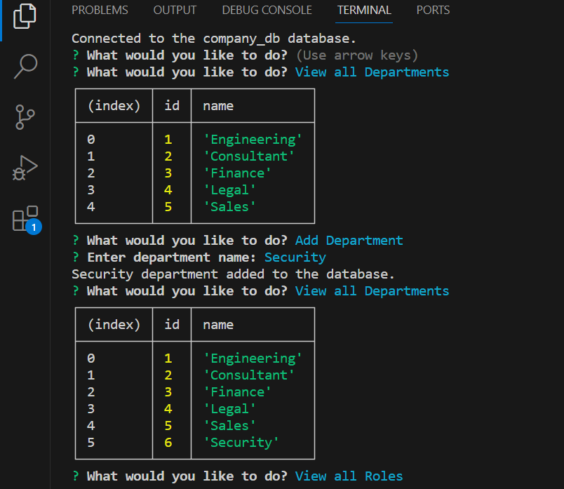
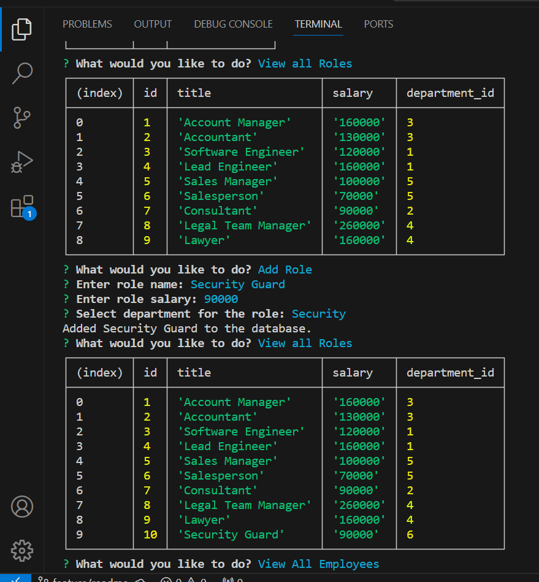
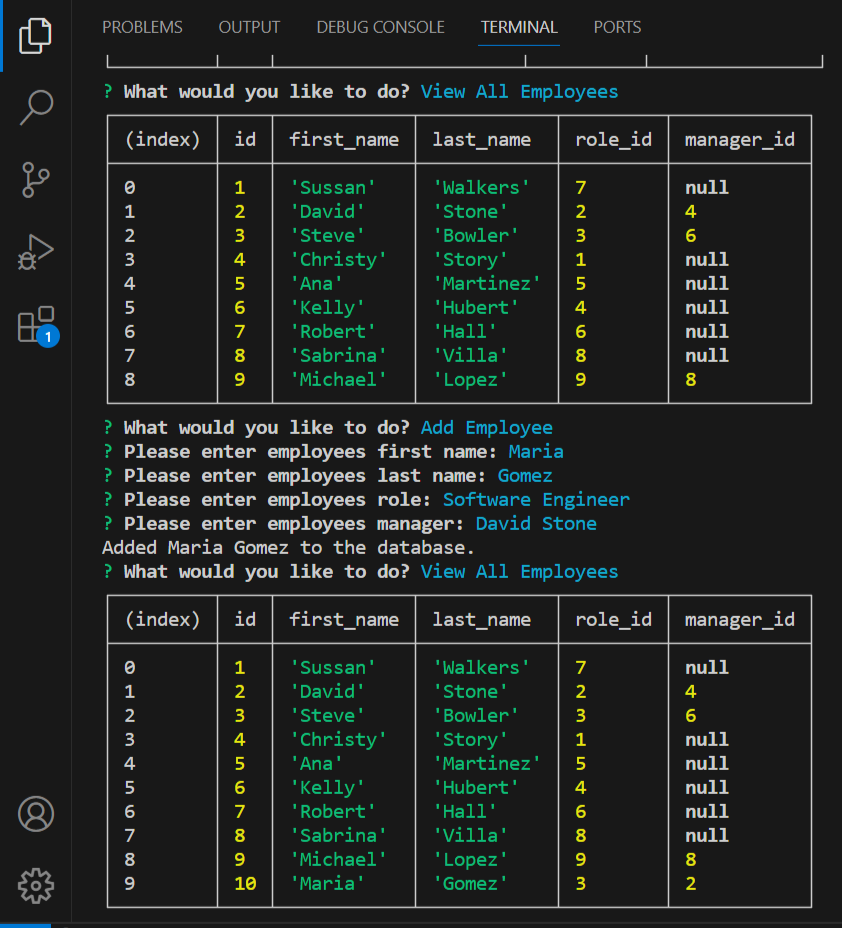
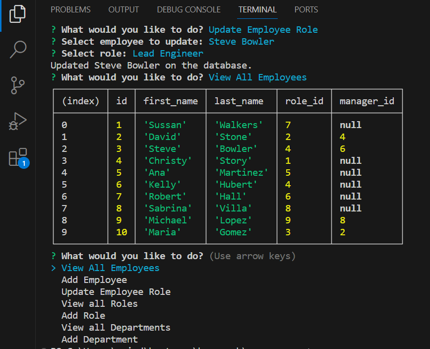

# Company CMS

## Description

A command-line app to be able to view and add employees, roles and departments in the company database. Can also update an employee's role.

Video walkthrough: https://watch.screencastify.com/v/4MiWbVy2LdxIkYssJU7B

## Installation

* Run schema, and seed - I used MySQL Workbench
* Update database connection information
* npm i 

## Usage

Run node server.js in the command line. Can select from the options using the arrow keys and pressing Enter. Have the options to View All Employees, View all Roles, View all Departments, Add an Employee, Add a Role, Add a Department, and Update an Employees' Role. When view is selected a table is displayed with the information from the database. When Add/Update is selected, there will be a number of prompts to answer.

### Screenshots
* View Department/Add a Department:

* View Roles / Add a Role:

* View Employees / Add an Employee:

* Update an Employee's Role / View Employees:

## License

MIT 